# ESP8266连接bluemix云平台

1. 使用Arduino IDE烧写connect_bluemix.ino到ESP8266模块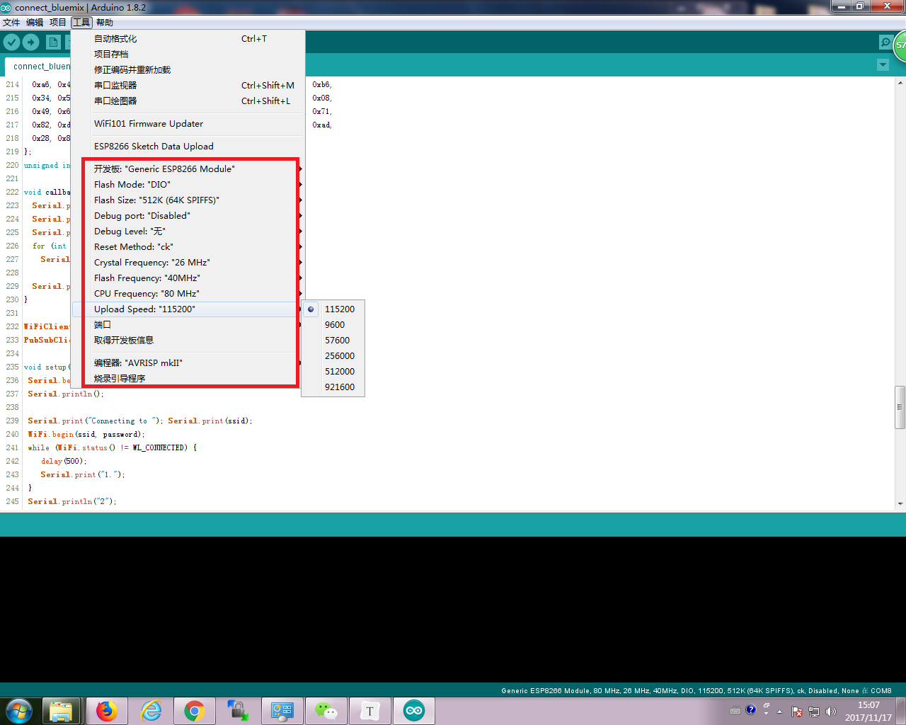

2. 修改相应配置

   * 修改为WIFI用户名和密码

     `const char* ssid = "maple";`

     `const char* password = "12345678";`

   * 定义设备

     `# define ORG "dyob0d"`

     `# define DEVICE_TYPE "ESP8266"`

     `# define DEVICE_ID "Test3"`

     `# define TOKEN "@maple123456"`

#  ESP8266获得温度传感器ds18b20数据

1. ds18b20原理图

   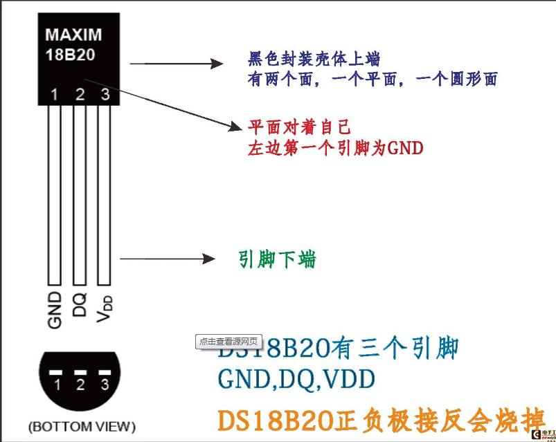

2. ESP8266连接ds18b20

   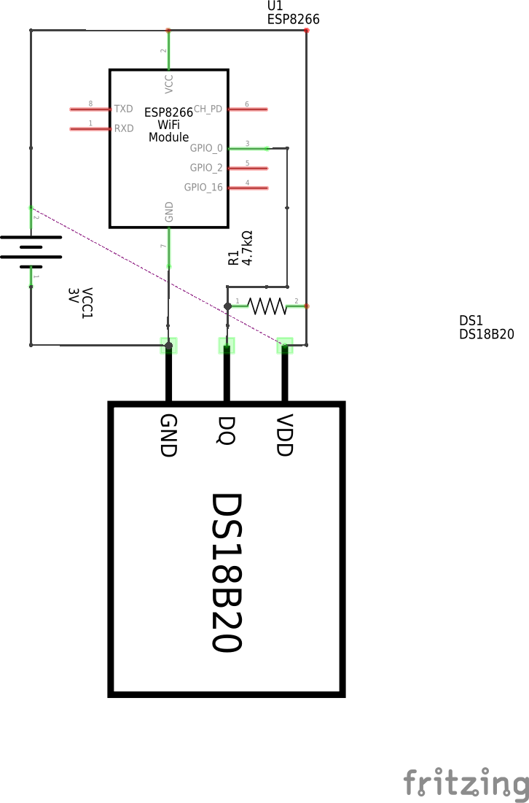

> ESP8266烧写代码，采用gpio0和gpio2连接DS18b20的data引脚，烧写代码详见ds18b20.ino

# Arduino UNO采集普粉尘传感器数据并转为PM2.5(GP2Y1010AU0F)

1. 概述

   夏普灰尘传感器GP2Y10价格比较便宜，能够检测出室内空气中的灰尘和烟尘含量，检测原理是传感器中心有个洞可以让空气自由流过，定向发射LED光，通过检测经过空气中的灰尘折射过后的光线来判断灰尘的含量。

2. 规格参数

   - 工作电压: 5 ~ 7V

   - 工作温度: -10 ~ 65摄氏度

   - 最大电流: 20mA

3. 接线方式

   `Sharp pin 1 (V-LED) => 5V 串联1个150欧姆的电阻（最好在电阻一侧和GND之间再串联一个220uf的电容）`

   `Sharp pin 2 (LED-GND) => GND`

   ``Sharp pin 3 (LED) => Arduino PIN 2 （开关LED）`

   `Sharp pin 4 (S-GND) => GND`

   ``Sharp pin 5 (Vo) => Arduino A0 pin （空气质量数据通过电压模拟信号输出）`

   `Sharp pin 6 (Vcc) => 5V`

   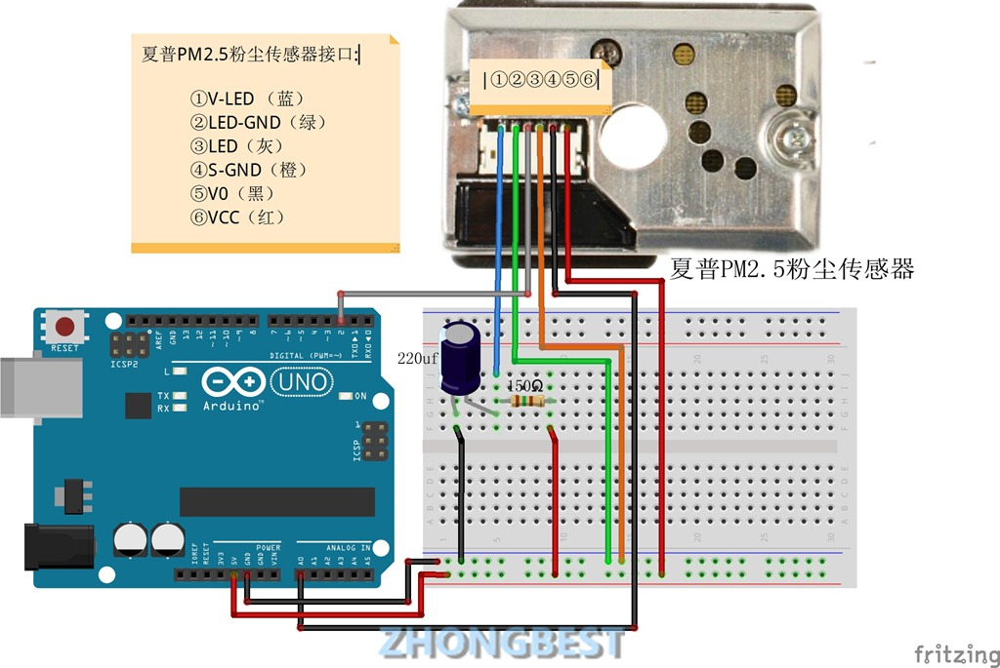

4. 烧写uno板子

   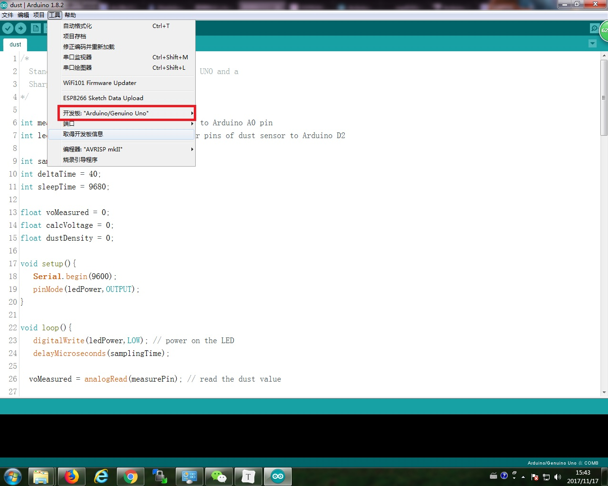

   > uno板烧写代码dust.ino

# uno板子采集火焰传感器数据

1. 概述

   红外火焰传感器可以用来探测火源或其它一些波长在760纳米～1100纳米范围内的热源，探测角度达60度，其中红外光波长在940纳米附近 时，其灵敏度达到最大。 火焰传感器探头的工作温度为-25摄氏度～85摄氏度，在使用过程中一定要注意火焰传感器探头离火焰的距离不能太近，以免造成损坏。下面为火焰传感器实测数据，一根蜡烛为火源，室内正常日光灯环境实测：无火源时，对着日光灯：0.35V-0.12V 10cm：4.98V 20cm：4.88V 30cm：4.72V 40cm：3.77V 50cm：2.89V 60cm：2.34V 70cm：1.92V 80cm：1.45V 90cm：1.15V 100cm：0.96。

2. 规格参数

   工作电压 ：+5v

   尺寸大小： 30mm x 25mm

   重量大小：3g

   信号类型：模拟信号

   工作环境：-25~+85℃

   存储温度：-30~+100℃

   接收波长：760纳米-1100纳米

3. 接口定义

   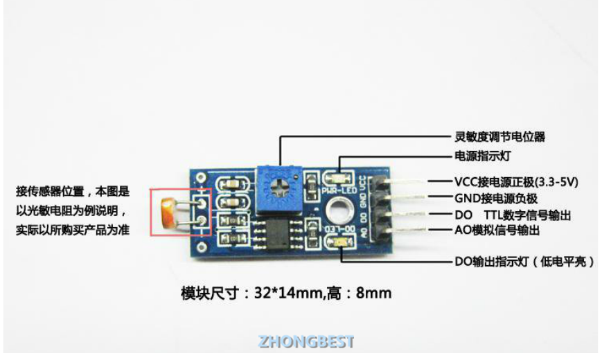

4. 接线方式

   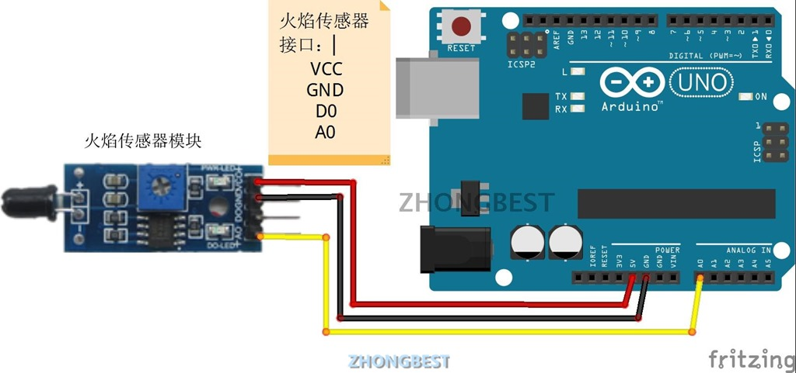

   > uno板烧写代码fire.ino 

# uno采集可燃气体传感器数据(MQ-2)

1. 概述

   MQ-2特点: 广泛的探测范围、高灵敏度、快速响应恢复、优异的稳定性、寿命长、简单的驱动电路
   MQ-2应用: 可用于家庭和工厂的气体泄漏监测装置， 适宜于液化气、丁烷、丙烷、甲烷、酒精、氢气、烟雾等的探测。
   MQ-2适用气体:可燃气体、烟雾
   MQ-2探测范围: 300 to 10000ppm
   MQ-2特征气体: 1000ppm异丁烷
   灵敏度 R in air/R in typical gas≥5
   敏感体电阻 1KΩ to 20KΩ in 50ppm甲苯
   响应时间 ≤10s
   恢复时间 ≤30s
   加热电阻 31Ω±3Ω
   加热电流 ≤180mA
   加热电压 5.0V±0.2V
   加热功率 ≤900mW
   测量电压 ≤24V
   MQ-2工作条件:环境温度：-20℃～+55℃
   湿度：≤95%RH
   环境含氧量：21%
   MQ-2贮存条件
    温度: -20℃～+70℃
   湿度:≤70%RH

2. 连接方式

   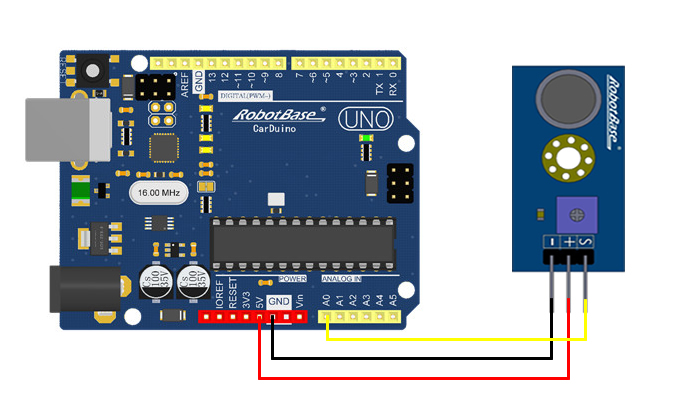

   > uno板烧写代码 gas.ino

# uno使用人体红外感应模块(HC-SR501)

1. 概述

   工作电压范围     直流电压4.5-20V

   静态电流              <50uA

   电平输出              高3.3 V /低0V

   触发方式              L不可重复触发/H重复触发(默认重复触发)

   延时时间              5-200S(可调)可制作范围零点几秒-几十分钟

   封锁时间              2.5S(默认)可制作范围零点几秒-几十秒

   感应角度              <100度锥角

   工作温度              -15-+70度

2. 接线方式

   VCC接 Arduino 3.3V
   GND接 Arduino GND
   OUT接 Digital 2

   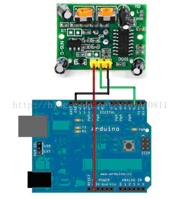

   > uno板烧写代码infrared.ino

# uno使用超声测距模块采集距离数据(US-015)

1. 概述

   US-015是目前市场上分辨率最高，重复测量一致性最好的超声波测距模块；US-015的分辨率高于1mm，可达0.5mm，测距精度高；重复测量一致性好，测距稳定可靠。

   US-015超声波测距模块可实现2cm~4m的非接触测距功能，供电电压为5V，工作电流为2.2mA，支持GPIO通信模式，工作稳定可靠。

2. 规格参数

   工作电压                         DC 5V

   工作电流                         2.2mA

   工作温度                         0~+70度

   输出方式                         GPIO

   感应角度                         小于15度

   探测距离                         2cm-400cm

   探测精度                         0.1cm+1%

   分辨率                             高于1mm（可达0.5mm）

3. 接口定义

   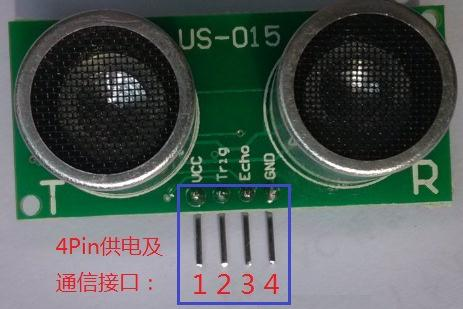

   从左到右依次编号1,2,3,4。它们的定义如下：

   - 1号Pin：接VCC电源（直流5V）。

   - 2号Pin：接外部电路的Trig端，向此管脚输入一个10uS以上的高电平，可触发模块测距。

   - 3号Pin：接外部电路的Echo端，当测距结束时，此管脚会输出一个高电平，电平宽度为超声波往返时间之和。

   - 4号Pin：接外部电路的地。

4. 连接方式

   VCC接 Arduino 5V

   GND接 Arduino GND

   Echo接 Digital 2

   Trig接 Digital 3

   > uno烧写代码ranging.ino

# ESP8266连接温湿度传感器（DHT11）和夏普粉尘传感器发送数据到bluemix云平台

> 参考uno的采集方式连接夏普粉尘传感器到esp8266
>
> 下面的参数介绍都为DHT11

1. 概述

   此款传感器是一款含有已校准数字信号输出的温湿度复合传感器。它应用专用的数字模块采集技术和温湿度传感技术，确保产品具有极高的可靠性与卓越的长期稳定性。传感器包括一个电阻式感湿元件和一个NTC测温元件，并与一个高性能8位单片机相连接。因此该产品具有品质卓越、超快响应、抗干扰能力强、性价比极高等优点。每个DHT11传感器都在极为精确的湿度校验室中进行校准。校准系数以程序的形式储存在OTP内存中，传感器内部在检测信号的处理过程中要调用这些校准系数。单线制串行接口，使系统集成变得简易快捷。超小的体积、极低的功耗，信号传输距离可达20米以上，使其成为各类应用甚至最为苛刻的应用场合的最佳选则。

2. 规格参数

   - 工作电压 ：3.3V~5v

   * 尺寸大小：40mm x 28mm

   * 重量大小：3g

   * 信号类型：数字信号

   * 供电电流：最大2.5mA

   * 温度范围：0-50℃，误差±2℃

   * 湿度范围：当环境温度在 0 ℃时为30~90%RH;当环境温度在25℃时为20~90%RH ;当环境温度在50℃时为20~80%RH

   * 响应时间：1/e(63%) 6-30s

   * 测量分辨率分别为：温度（8bit）湿度（8bit）
   * 采样周期间隔：<1s

3. 接口定义

   DATA:信号引脚，连接GPIO

   VCC:电源引脚

   GND：接地引脚

   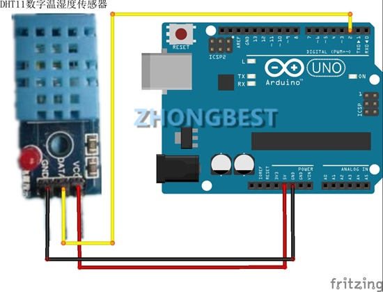

   > 采用esp8266烧写，可烧写代码TEST_DHT11.ino(只包含dht11)，temp_humi_dust.ino(包涵dht11和粉尘传感器)

# uno 采集声音模块数据(Sound Sensor V2)

1. 概述

   采用音频处理芯片LM386 

   对音频信号进行200倍放大 

   灵敏度可调 

   信号输出指示 

2. 规格参数

   工作电压范围：3.3 / 5V
   工作电流：（Vcc = 5V）4〜5 mA
   电压增益：（V = 6V，f = 1kHz）26 dB
   麦克风灵敏度：（1kHz）52-48 dB
   麦克风阻抗：2.2k欧姆
   麦克风频率：16-20 kHz
   麦克风S / N无线电：54分贝

3. 接口定义

   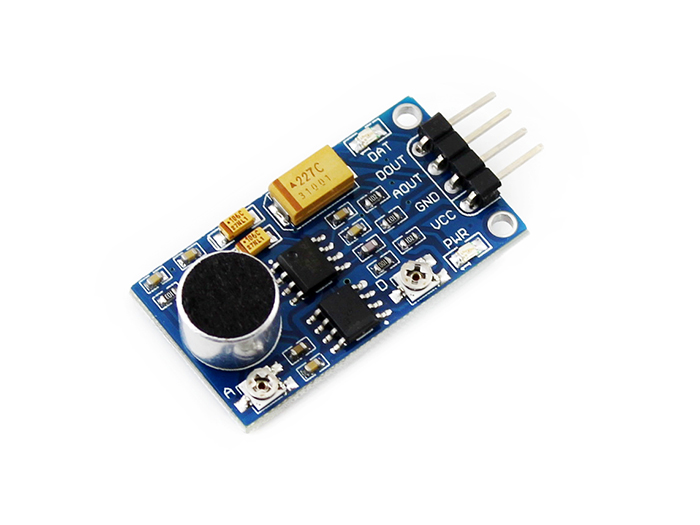

   - VCC：接3.3V ~ 5.3V

   - GND：接GND

   - AOUT：接MCU.IO (模拟量输出)

   - DOUT：接MCU.IO (数字量输出)

   > uno 板烧写voice.ino为只采集声音数据，烧写voice_on_off.ino包涵继电器的连接可用作声控开关

# uno 采集水位传感器模块数据(Water Sensor)

1. 概述

   Water Sensor水位传感器是一款简单易用、性价比较高的水位/水滴识别检测传感器，其是通过具有一系列的暴露的平行导线线迹测量其水滴/水量大小从而判断水位。轻松完成水量到模拟信号的转换，输出的模拟值可以直接被Arduino开发板读取，达到水位报警的功效。

2. 规格参数

   工作电压：DC3-5V

   工作电流：小于20mA

   传感器类型：模拟

   检测面积：40mm x 16mm

   制作工艺：FR4双面喷锡

   工作温度：10℃-30℃

   工作湿度：10%-90%无凝结

   产品重量：3.5g

   产品尺寸：62mm x 20mm x 8mm

   包装方式：静电袋密封

3. 接口定义

   S：信号输出
   VCC：电源正极
   GND：电源负极

4. 模块特性

   简易液位传感器，利用电阻变化测量液位高度
   液位越高传感器与水面接触面积越大输出电压越高，反之减小
   将传感器固定在要检测的水面，通过AD转换电压信号，即可检测液位高度
   可以Arduino、水泵连接，组成水位动态调整系统
   传感器采用沉浸技术，增加使用寿命
   传感器有刻度标注，方便自行标定数值
   注意：此传感器为消耗品，会受液体氧化腐蚀

5. 连接方式

   5V --------->+

   GND ------->–

   A0 --------->S

   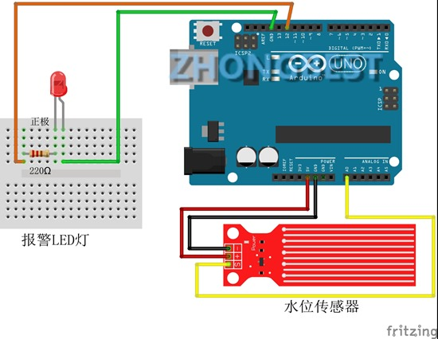

   > 采用uno开发板按图接线，可接led显示，烧写uno代码Water_level.ino

